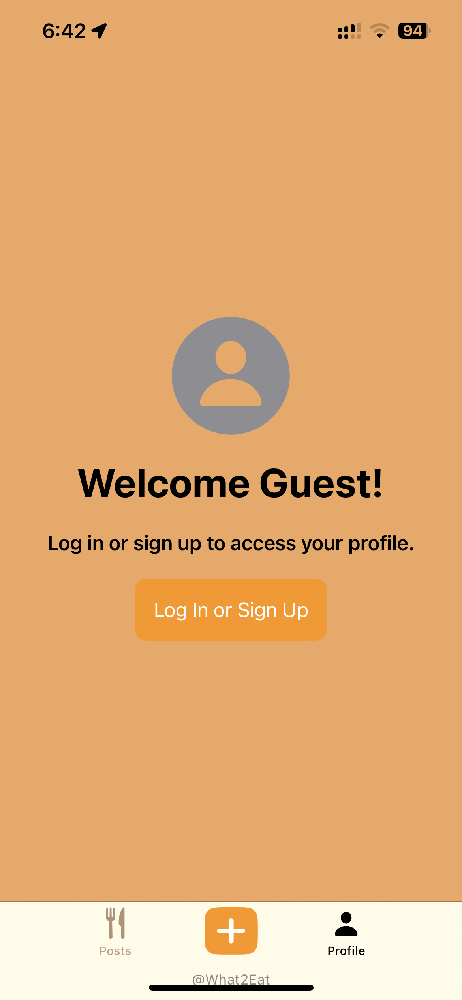
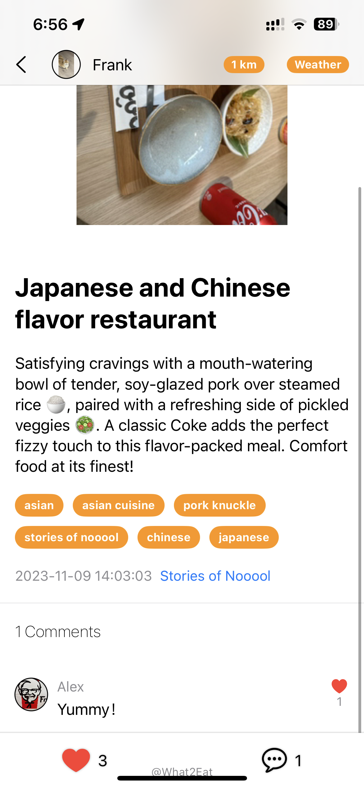
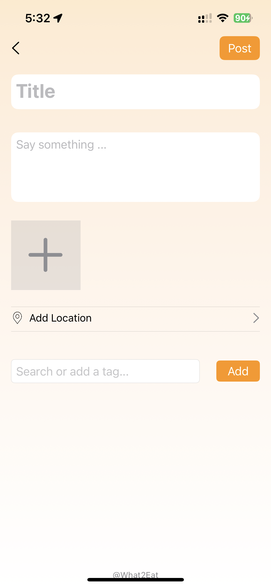
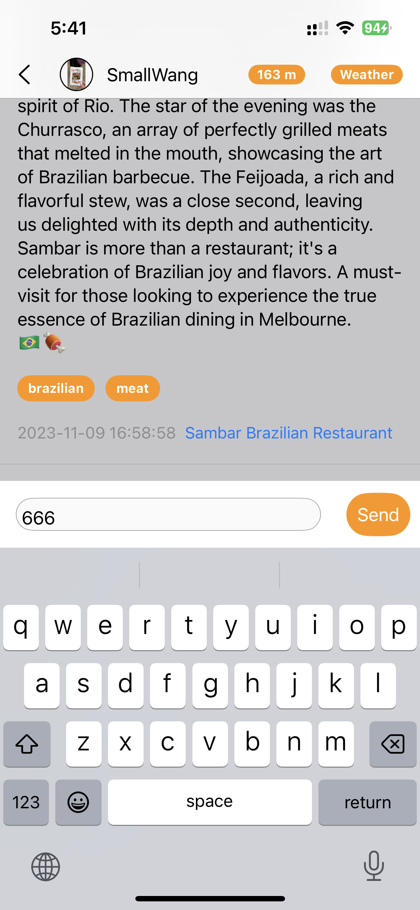
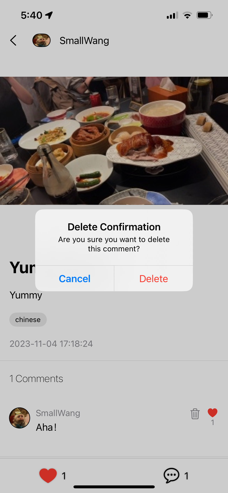
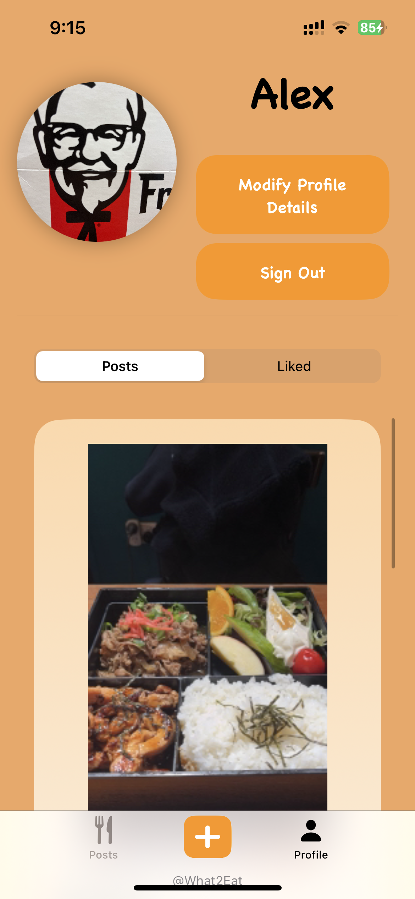
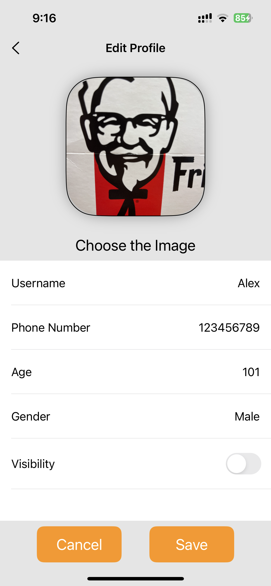
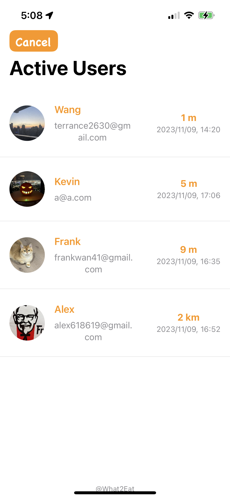
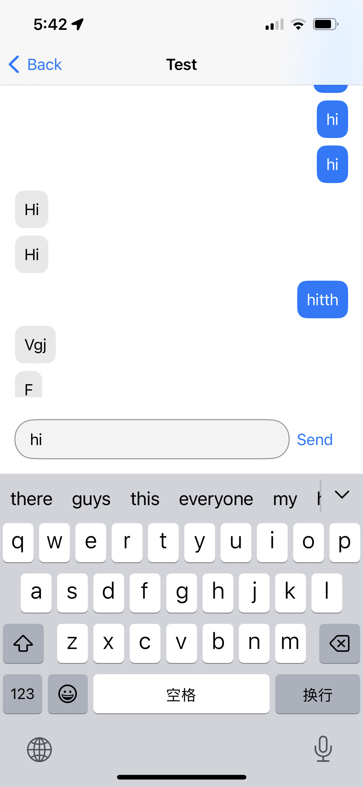

# COMP90018_SoftwareProject-What2Eat

## Table of Contents

- [What2Eat](#comp90018_SoftwareProject-what2eat)
  - [Introduction](#introduction)
  - [Table of Contents](#table-of-contents)
  - [Demo Video](#demo-video)
  - [User Guide](#user-guide-and-key-features)
    - [Guest Mode](#guest-mode)
      - [Welcome](#welcome)
      - [Read Posts](#read-posts-as-a-guest-if-yes)
      - [Shake a Tag](#shake-a-kind-of-cuisine-if-no)
      - [Log In or Sign Up](#log-in-or-sign-up)
    - [User Mode](#user-mode)
      - [Like Post or Comment](#like-post-or-comment)
      - [Send or Delete Post](#send-or-delete-post)
      - [Send or Delete Comment](#send-or-delete-comment)
      - [View Own or Liked Posts](#view-own-or-liked-posts)
      - [Edit Profile](#edit-profile)
      - [Chat with Nearby Users](#chat-with-nearby-users)
  - [Team Members](#team-members)
  - [Technologies Applied](#technologies-applied)
  - [Development Setup](#development-setup)

## Introducion
Developed an iOS mobile application named What2Eat, aimed at resolving users' meal choice dilemmas and providing a platform for user-generated content, primarily through user posts. What2Eat seeks to simplify users' dining choices, encouraging the sharing of culinary experiences and social interaction.

User Posts: Users can share their food adventures, cooking ideas, and dining questions in the form of posts, creating their own food diaries.

Social Interaction: Users can like and comment on other users' posts and view posts they have liked.

Diverse Display: Users can browse geolocation-based posts in a map format.

Random Dining Selection: Users can search for posts with random food tags by shaking their device.

Social Interaction: Users can chat with other active users, with active users sorted by geographical proximity.

## [Demo Video]()

## User Guide and Key Features

### Guest Mode

#### Welcome

#### Read Posts as A Guest If YES

  
  

#### Shake A Kind of Cuisine If NO

  
  

#### Log In or Sign Up 

  
  
  
  
  
  

### User Mode

#### Like Post or Comment

  
  

#### Send or Delete Post

  
  

#### Send or Delete Comment

  
  

#### View Own or Liked Posts

  
  

#### Edit Profile

  

#### Chat with Nearby Users

  
  
  

## Team Members

- [Bowen Fan](https://github.com/bowenfan-unimelb)
- [Junran Lin](https://github.com/junranLin)
- [Shuyu Chen](https://github.com/shuyu0619)
- [Tianqi Wang](https://github.com/terrance2630)
- [Yicong Wan](https://github.com/frankwan41)

## Technologies Applied

| Description     | Tool               |
| --------------- | ------------------ |
| Environment     | Xcode              |
| UI Design       | SwiftUI            |
| Development     | Swift              |
| Deployment      | Application Loader |
| Verison Control | Github             |
| Authentication  | Firebase           |
| Backend Database and Storage | Firebase |

## Development Setup

1. Clone the repo into Your Macbook
2. Open the folder COMP90018_APP in Xcode
3. Change the team(your personal team) and bundle ID (arbitrary one for testing) in General Setting
4. Build the Application on iPhone (In the developer mode and trust the application)
