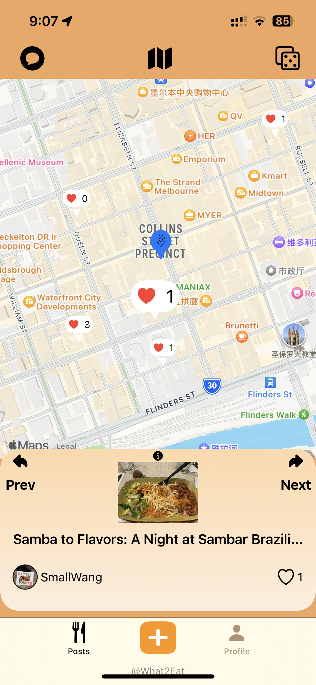
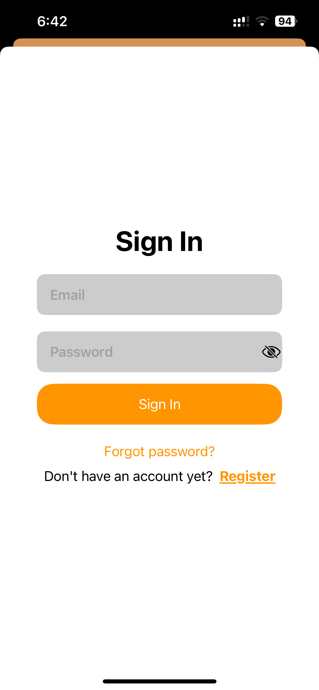

# COMP90018_SoftwareProject-What2Eat

## Table of Contents

- [What2Eat](#comp90018_SoftwareProject-what2eat)
  - [Table of Contents](#table-of-contents)
  - [Demo Video](#demo-video)
  - [User Guide](#user-guide-and-key-features)
    - [Guest Mode](#guest-mode)
      - [Welcome](#welcome)
      - [Read Posts](#read-posts-as-a-guest-if-yes)
      - [Shake a Tag](#shake-a-kind-of-cuisine-if-no)
      - [Log In or Sign Up](#log-in-or-sign-up)
    - [User Mode](#user-mode)
  - [Team Members](#team-members)
  - [Technologies Applied](#technologies-applied)
  - [Development Setup](#development-setup)

## [Demo Video]()

## User Guide and Key Features

### Guest Mode

#### Welcome

#### Read Posts as A Guest If YES

  
  

#### Shake A Kind of Cuisine If NO

  
  

#### Log In or Sign Up 

  
  
  
  
  
  

### User Mode

## Team Members

- [Bowen Fan](https://github.com/bowenfan-unimelb)
- [Junran Lin](https://github.com/junranLin)
- [Shuyu Chen](https://github.com/shuyu0619)
- [Tianqi Wang](https://github.com/terrance2630)
- [Yicong Wan](https://github.com/frankwan41)

## Technologies Applied

| Description     | Tool               |
| --------------- | ------------------ |
| Environment     | Xcode              |
| UI Design       | SwiftUI            |
| Development     | Swift              |
| Deployment      | Application Loader |
| Verison Control | Github             |
| Authentication  | Firebase           |
| Backend Database and Storage | Firebase |

## Development Setup

